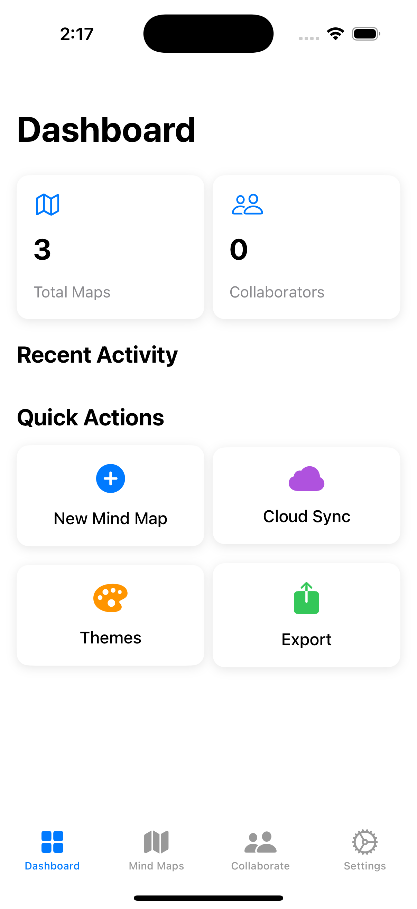

# MindMapApp

An **Interactive Mind Mapping App** built with **SwiftUI**. This app allows users to create, edit, and visualize mind maps with dynamic nodes, connections, and customizable themes.

---

## Features

- **Create and Manage Nodes:**
  - Add, edit, and delete nodes dynamically.
  - Drag and drop nodes to rearrange them.
  - Customize node colors, shapes, and text.

- **Interactive Mind Map:**
  - Pinch-to-zoom and pan gestures for navigation.
  - Force-directed graph layout for automatic node arrangement.

- **Collaboration:**
  - Track changes made by collaborators.
  - View active collaborators and their recent activities.

- **Export and Sync:**
  - Export mind maps as **PDF**, **Markdown**, **FreeMind**, or **JSON**.
  - Sync mind maps to the cloud for backup and collaboration.

- **Themes:**
  - Customize the mind map's appearance with themes.
  - Choose from predefined themes or create your own.

---

## Screenshots




---

## Requirements

- **Xcode 16.2** or later.
- **iOS 18.2** or later.
- **Swift 6**.

---

## Installation

1. **Clone the Repository:**
   ```bash
   git clone (https://github.com/Faycel2015/MindMapApp.git)
